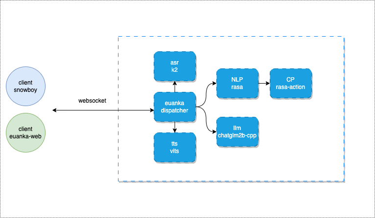
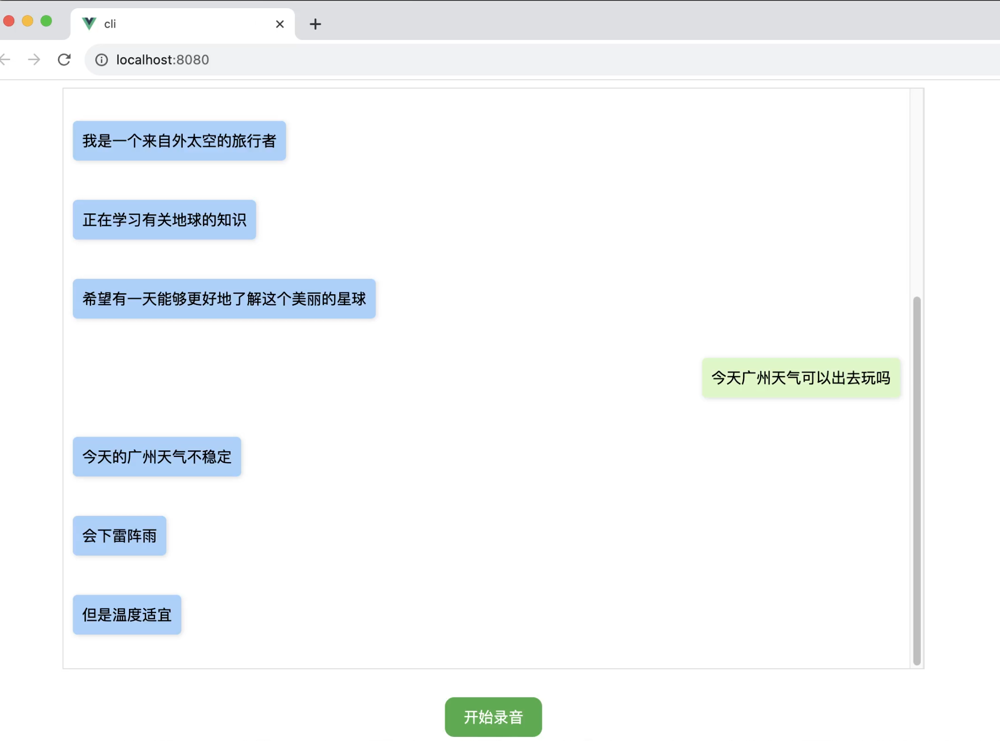
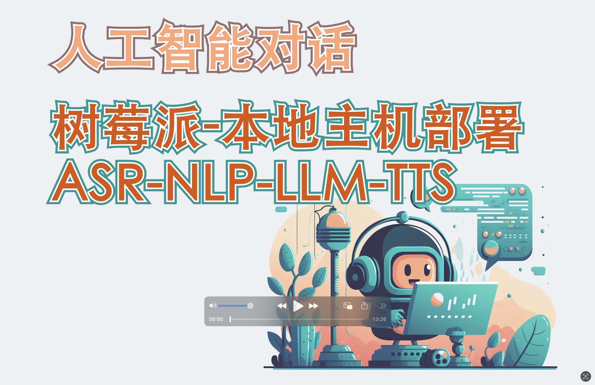

### 介绍

这是一个即将起步的AI对话服务体系，当然当前都是构思完善中，如果有人喜欢会继续更新...

**当前最需要的是你的 STAR，谢谢！** 

**当前最需要的是你的 STAR，谢谢！** 

**当前最需要的是你的 STAR，谢谢！** 

#### 服务架构



#### 使用 euanka-web 前端效果


#### 使用树莓派 4麦克风阵列 定制唤醒交互

视频如下： 

[](https://www.bilibili.com/video/BV12c411c7sz?t=47.7)

### 环境

当前构建的版本都是 x86架构，i5 8gen 4核32G，可以缓慢运行 

### 构建
#### 本地构建
构建
```
go build src/main.go
```

运行
```shell
./main
```
#### docker 构建

```
docker build -t registry.cn-shenzhen.aliyuncs.com/yuanfangqiao/euanka:0.1 .
```

### 支持一键运行，docker-compose

到docker-compose文件夹，使用docker-compose一键启动
```
docker-compose -f euanka-all-compose.yaml up -d
```

查看启动情况
```
docker-compose -f euanka-all-compose.yaml ps
```
如下，全部启动成功就可以访问
```
             Name                           Command               State                    Ports
------------------------------------------------------------------------------------------------------------------
docker-compose_action-server_1   ./entrypoint.sh start --ac ...   Up      0.0.0.0:5055->5055/tcp,:::5055->5055/tcp
docker-compose_asr_1             ./build/bin/sherpa-onnx-on ...   Up      0.0.0.0:6006->6006/tcp,:::6006->6006/tcp
docker-compose_euanka-web_1      /docker-entrypoint.sh /bin ...   Up      0.0.0.0:80->80/tcp,:::80->80/tcp
docker-compose_euanka_1          /bin/demo                        Up      0.0.0.0:8080->8080/tcp,:::8080->8080/tcp
docker-compose_llm_1             python -u websokcet_server ...   Up      0.0.0.0:7600->7600/tcp,:::7600->7600/tcp
docker-compose_rasa_1            rasa run                         Up      0.0.0.0:5005->5005/tcp,:::5005->5005/tcp
docker-compose_tts_1             python3 -u app.py                Up      0.0.0.0:7860->7860/tcp,:::7860->7860/tcp
```

当前已经部署euanka-web前端，直接网页访问即可 如：http://192.168.1.16 即可，需要参考euanka-web项目解决录音问题
访问效果如下如上web效果。


### 依赖项目

**需要以下所有项目支持，并且全部实现docker构建运行。**

项目可做学习参考使用。

- [树莓派 语音终端 Snowboy唤醒 GO实现]( https://github.com/yuanfangqiao/euanka-client.git)

- [网页对话 Vue实现]( https://github.com/yuanfangqiao/euanka-client.git)

- [流式识别 ASR K2]( https://github.com/yuanfangqiao/sherpa-onnx-euanka.git)

- [自然语言处理 NLP Rasa]( https://github.com/yuanfangqiao/euanka-rasa.git)

- [大模型 LLM chatglm.cpp]( https://github.com/yuanfangqiao/chatglm.cpp)

- [文本转语音 TTS Vits]( https://github.com/yuanfangqiao/VITS-Umamusume-voice-synthesizer.git)


### 鸣谢

感谢以下开源项目的支撑！ 

- [sherpa-onnx]( https://github.com/k2-fsa/sherpa-onnx.git)

- [rasa](https://github.com/RasaHQ/rasa.git)

- [spacy](https://github.com/explosion/spaCy.git)

- [spacy-models](https://github.com/explosion/spacy-models)

- [chatglm.cpp](https://github.com/li-plus/chatglm.cpp)

- [VITS-Umamusume-voice-synthesizer](https://huggingface.co/spaces/Plachta/VITS-Umamusume-voice-synthesizer)
